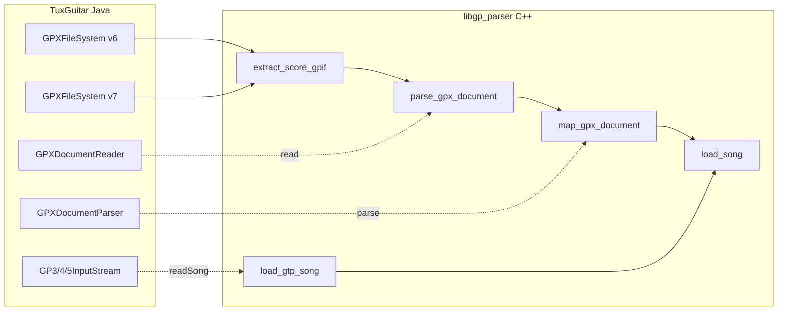

# libgp_parser — Port from TuxGuitar

Status: import parity with TuxGuitar’s GPX/GTP **read** path (`https://github.com/helge17/tuxguitar`, modules `TuxGuitar-gpx` and `TuxGuitar-gtp`). Consumer API: `load_song()`.

## What has been ported?

| TuxGuitar module | Java classes (excerpt) | C++ equivalent | Status |
|------------------|------------------------|----------------|--------|
| GPX container v6 | `GPXFileSystem` (v6) | `GpxGp6FileSystem`, `gpx_format` | **done** (BCFS/BCFZ, score.gpif) |
| GPX container v7 | `GPXFileSystem` (v7) | `GpxZipArchive`, `extract_score_gpif` | **done** (ZIP, `Content/score.gpif`, VERSION `7.0`) |
| GPX XML reading | `GPXDocumentReader` | `parse_gpx_document`, `gpx_xml` | **done** (score, tracks, master bars, bars, voices, beats, notes, rhythms, chords, automations) |
| GPX → song | `GPXDocumentParser` | `map_gpx_document` | **done** (timing, notes, effects, chords, strokes, simile) |
| GPX intermediate model | `GPXScore`, `GPXTrack`, `GPX*` | `GpxDocument`, `Song`, `Track` | **done** |
| GTP binary | `GP3/4/5InputStream`, `GTPFileFormat` | `BinaryReader`, `load_gtp_song` | **done** (info, mixer, lyrics, headers, measures, notes, mix-change tempo) |
| GTP normalizer | `GTPSongNormalizer` | `normalize_gtp_channels` | **done** |
| Playback helpers | `MidiRepeatController`, pitch/ticks | `timeline.hpp` | **done** (legacy ticks, not `preciseStart`) |

**Not ported** (still only in TuxGuitar): desktop UI, audio (Gervill/FluidSynth), editor, GP3–GP5 writers, GP1/GP2.

## How much is implemented?

Estimate **relative to the GPX/GTP read path** in TuxGuitar (not the whole application):

| Area | Share | Notes |
|------|-------|--------|
| File containers (.gp / .gpx / .gp3–.gp5 detect & open) | **~95%** | ZIP VERSION 7.0, BCFS, BCFZ, GTP magic |
| Score metadata (title, artist, …) | **~95%** | GPX `readScore` + GTP `readInfo` |
| Track headers (name, tuning, MIDI, color, capo) | **~95%** | GPX `readTracks` + GTP `readTrack` + mixer |
| Tempo | **~90%** | GPX automations; GTP global tempo + mix-change tempo |
| Musical content (measures, beats, notes, effects) | **~90%** | TG mapping limits below |
| **Overall GPX+GTP import pipeline** | **~90%** | TuxGuitar import parity |

For **all of TuxGuitar** (editor, player, plugins): still a standalone library only.

## Architecture (simplified)

## Mapping limits (parity with TuxGuitar, not lossless GP)

- Mix-change: block is consumed; **only tempo** is applied to the measure header.
- Slide subtypes: stored as boolean `slide`.
- Lyrics: GTP keeps **one** track (first of five blocks); **GPX lyrics are not imported**.
- Voices: max 2; further GPX voices are dropped.
- Beat-level tap/slap/pop/whammy/fade: copied onto notes.
- GP extras outside `TGSong` (rasgueado, ottava, fermata, wah, fingering, RSE): omitted.
- Timing: `Beat.start` / `Duration::time()` use `QUARTER_TIME` (960). No `preciseStart`.
- Consumer path is `load_song()`, not the older `parse_gpx_score_metadata` / `parse_gpx_tracks` / `parse_gpx_initial_tempo` helpers.

## Doxygen in headers

Public API in `include/libgp_parser/` is documented in **English** with Doxygen. Each entry includes:

- **TuxGuitar source:** Java path and method
- **Brief:** one-line description
- **Visibility:** `public` or `private`

Internal helpers in `.cpp` files (anonymous `namespace`) are **private** and not listed in the public headers.

## TuxGuitar reference paths

| Topic | Path in repo |
|-------|----------------|
| GPX reading | `common/TuxGuitar-gpx/src/app/tuxguitar/io/gpx/GPXDocumentReader.java` |
| GPX → TGSong | `common/TuxGuitar-gpx/src/app/tuxguitar/io/gpx/GPXDocumentParser.java` |
| GPX container v6 | `common/TuxGuitar-gpx/src/app/tuxguitar/io/gpx/v6/GPXFileSystem.java` |
| GPX container v7 | `common/TuxGuitar-gpx/src/app/tuxguitar/io/gpx/v7/GPXFileSystem.java` |
| GTP reading | `common/TuxGuitar-gtp/src/app/tuxguitar/io/gtp/GP5InputStream.java` (also GP3/GP4) |
| Repeat expansion | `common/TuxGuitar-lib/.../player/base/MidiRepeatController.java` |
| GPX score model | `common/TuxGuitar-gpx/src/app/tuxguitar/io/gpx/score/GPX*.java` |
