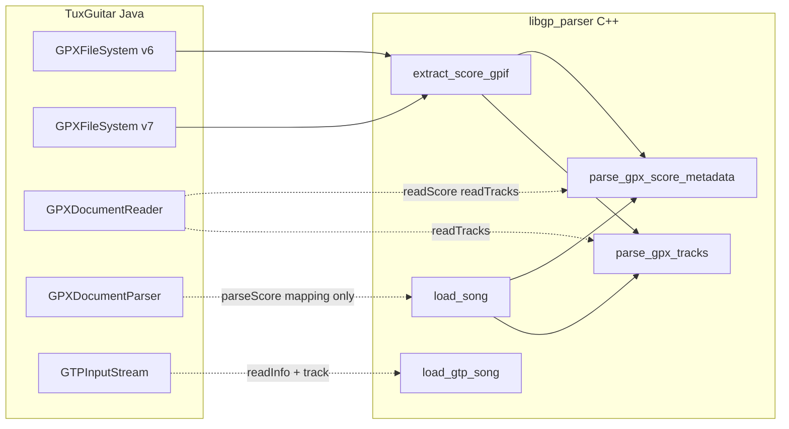

# libgp_parser — Port from TuxGuitar

Status: analysis of `libgp_parser` against TuxGuitar sources under `https://github.com/helge17/tuxguitar/tree/master/common/TuxGuitar-gpx` and `https://github.com/helge17/tuxguitar/tree/master/common/TuxGuitar-gtp`.

## What has been ported?

| TuxGuitar module | Java classes (excerpt) | C++ equivalent | Status |
|------------------|------------------------|----------------|--------|
| GPX container v6 | `GPXFileSystem` (v6) | `GpxGp6FileSystem`, `gpx_format` | **done** (BCFS/BCFZ, score.gpif) |
| GPX container v7 | `GPXFileSystem` (v7) | `GpxZipArchive`, `extract_score_gpif` | **done** (ZIP, `Content/score.gpif`) |
| GPX XML reading | `GPXDocumentReader` | `parse_gpx_score_metadata`, `parse_gpx_tracks`, `parse_gpx_initial_tempo`, `gpx_xml` | **partial** |
| GPX → song | `GPXDocumentParser` | `Song`, `Track`, `apply_gpx_tempo_modifier` | **metadata only** (no TGSong, no bars/notes) |
| GPX intermediate model | `GPXScore`, `GPXTrack` | `SongMetadata`, `Track` | **metadata layer** |
| GTP binary | `GTPInputStream`, `GTPFileFormat` | `BinaryReader`, `load_gtp_song` | **partial** (info + tracks; rest skipped) |

**Not ported** (still only in TuxGuitar): desktop UI, audio (Gervill/FluidSynth), editor, `GPXDocumentParser.parseBar` / `parseNote`, all effects, rhythms, chords, GPX export, song normalizer (`GTPSongNormalizer`), full `TGSong` model.

## How much is implemented?

Estimate **relative to the GPX/GTP read path** in TuxGuitar (not the whole application):

| Area | Share | Notes |
|------|-------|--------|
| File containers (.gp / .gpx / .gp3–.gp5 detect & open) | **~90%** | ZIP, BCFS, BCFZ, GTP magic |
| Score metadata (title, artist, …) | **~95%** | GPX `readScore` + GTP `readInfo` |
| Track headers (name, tuning, MIDI, color, capo) | **~80%** | GPX `readTracks` + GTP track header |
| Initial tempo | **~60%** | GPX tempo automation; GTP global tempo |
| Musical content (measures, beats, notes, effects) | **~0%** | Not started |
| **Overall GPX+GTP import pipeline** | **~15–20%** | Phase 1 per README |

For **all of TuxGuitar** (editor, player, plugins): **< 1%** — only the standalone `libgp_parser` library exists so far.

## Architecture (simplified)

## Todo — what is still missing

1. **GPX `GPXDocumentReader`:** `readMasterBars`, `readBars`, `readVoices`, `readBeats`, `readNotes`, `readRhythms`, `readChords`, full `readAutomations`.
2. **GPX `GPXDocumentParser`:** `parseMasterBars`, `parseBar`, `parseNote`, and all effect helpers (bend, harmonic, …).
3. **GTP:** read notes and measures instead of `skip_measure_headers` / ignoring the rest of the file.
4. **Domain model:** types for `Measure`, `Beat`, `Note` (like `TGMeasure` / `GPXBeat`).
5. **GP7 version:** `GPXFileSystem.isSupportedVersion()` — version check in ZIP.
6. **Channel deduplication:** `getFreeGmChannel` / `channel_id` as in `parseTracks`.
7. **Tests:** more GP6/GP7 fixtures; property tests against the Java reference.

## Doxygen in headers

Public API in `libgp_parser/include/libgp_parser/` is documented in **English** with Doxygen. Each entry includes:

- **TuxGuitar source:** Java path and method
- **Brief:** one-line description
- **Visibility:** `public` or `private`

Internal helpers in `.cpp` files (anonymous `namespace`) are **private** and not listed in the public headers.

## TuxGuitar reference paths

| Topic | Path in repo |
|-------|----------------|
| GPX reading | `common/TuxGuitar-gpx/src/app/tuxguitar/io/gpx/GPXDocumentReader.java` |
| GPX → TGSong | `common/TuxGuitar-gpx/src/app/tuxguitar/io/gpx/GPXDocumentParser.java` |
| GPX container v6 | `common/TuxGuitar-gpx/src/app/tuxguitar/io/gpx/v6/GPXFileSystem.java` |
| GPX container v7 | `common/TuxGuitar-gpx/src/app/tuxguitar/io/gpx/v7/GPXFileSystem.java` |
| GTP reading | `common/TuxGuitar-gtp/src/app/tuxguitar/io/gtp/GTPInputStream.java` |
| GPX score model | `common/TuxGuitar-gpx/src/app/tuxguitar/io/gpx/score/GPX*.java` |
